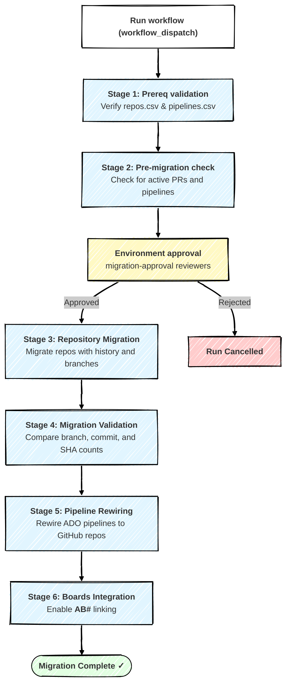

# 🚀 Azure DevOps to GitHub Repository Migration — GitHub Actions Workflow

[](https://opensource.org/licenses/MIT)
[](https://docs.github.com/actions)
[](https://github.com/github/gh-ado2gh)

> The GitHub Actions equivalent of the Azure DevOps `ado2gh-migration.yml` pipeline. A job-based workflow for migrating repositories from Azure DevOps to GitHub Enterprise at scale. Supports batch migrations, automated validation, pipeline rewiring, and Azure Boards integration.
>
> **Workflow file:** [`ado2gh-migration.yml`](./ado2gh-migration.yml)

---

## 🎯 Why a GitHub Actions version?

This workflow is a faithful translation of the Azure DevOps pipeline so teams that already operate from GitHub can run the same staged, self-service migration without an Azure DevOps pipeline. The six-stage flow, the manual approval gate, the partial-success model, and the `gh-ado2gh` tooling are all preserved — only the orchestration layer changes (Azure DevOps `stages` → GitHub Actions `jobs`).

---

## 📋 Table of Contents

- [Workflow Execution Model](#-workflow-execution-model)
- [Mapping from the Azure DevOps Pipeline](#-mapping-from-the-azure-devops-pipeline)
- [Limitations](#️-limitations)
- [Prerequisites](#️-prerequisites)
- [Quick Start](#-quick-start-your-first-migration)
- [FAQ](#-frequently-asked-questions)
- [License](#-license)

---

## 📋 Workflow Execution Model

> ℹ️ **Informational Only**
> This section is for conceptual understanding. Actual behavior is governed by [`ado2gh-migration.yml`](./ado2gh-migration.yml).

This workflow orchestrates a **six-stage sequential migration** from Azure DevOps to GitHub Enterprise. Each stage is a separate GitHub Actions **job**. Jobs run on **GitHub-hosted `ubuntu-latest`** by default, or on your own runners by selecting `self-hosted` for the `runner_label` input.

### Key Features

- **Partial Success:** **Stage 3 (Repository Migration)** uploads a `repos_with_status.csv` artifact (`migration-results`) tracking which repositories succeeded or failed. Stages 4–6 download this artifact and execute **only against successfully migrated repositories**. **Stage 5 (Pipeline Rewiring)** additionally reads `bash/pipelines.csv` and cross-references `repos_with_status.csv`.

- **Manual Approval Gate:** The **Migration** job is bound to the `migration-approval` GitHub **Environment**. If you add required reviewers to that environment, the run pauses before migration begins — the equivalent of the Azure DevOps `ManualValidation` step.

- **Job Dependencies:** Implemented with `needs:` plus `if:` conditions. Downstream jobs run only when the Migration job succeeds.

> **Note:** GitHub-hosted runners do not persist state between jobs, so the workflow uses `upload-artifact` / `download-artifact` for cross-stage continuity.



### Stage Execution Details

| Stage (Job) | Script | Notes |
|-------------|--------|-------|
| **1️⃣ Prerequisite Validation** (`prerequisite-validation`) | — | Verifies `bash/repos.csv` and `bash/pipelines.csv` exist and have the required columns. |
| **2️⃣ Pre-Migration Check** (`readiness-check`) | `1_pr_pipeline_check.sh` | Detects active builds, release pipelines, and pull requests. |
| **3️⃣ Repository Migration** (`migration`) | `2_migration.sh --csv bash/repos.csv` | Migrates content, branches, and history. Produces `repos_with_status.csv`. **Gated by the `migration-approval` environment.** |
| **4️⃣ Migration Validation** (`post-migration-validation`) | `3_post_migration_validation.sh` | Compares branch counts, commit counts, and latest SHAs. Successful repos only. |
| **5️⃣ Pipeline Rewiring** (`pipeline-rewiring`) | `4_rewire_pipeline.sh` | Rewires ADO pipelines to GitHub via service connection. Skipped when `runDemoRepoMigration = true`. |
| **6️⃣ Azure Boards Integration** (`azure-boards-integration`) | `5_boards_integration.sh` | Enables AB# work-item linking. Skipped when `runDemoRepoMigration = true` or `skipBoardsIntegration = true`. |

---

## 🔄 Mapping from the Azure DevOps Pipeline

| Azure DevOps concept | GitHub Actions equivalent |
|----------------------|---------------------------|
| `stages` | `jobs` chained via `needs:` |
| `ManualValidation@0` approval | `environment: migration-approval` on the Migration job (add required reviewers) |
| Variable group `core-entauto-github-migration-secrets` | Repository **secrets** `GH_PAT`, `ADO_PAT` |
| Variable group `azure-boards-integration-secrets` (Boards) | Secret `GH_BOARDS_PAT` (falls back to `GH_PAT`) |
| `useSelfHostedAgent` / agent pool | `runner_label` input (`ubuntu-latest` / `self-hosted`) |
| `PublishBuildArtifacts` / `DownloadBuildArtifacts` | `actions/upload-artifact` / `actions/download-artifact` |
| `runDemoRepoMigration`, `skipBoardsIntegration` | `workflow_dispatch` inputs (same names) |

---

## ⚠️ Limitations

#### 1️⃣ What Gets Migrated
- Git repository content (all files), complete commit history, all branches and tags, and commit metadata (authors, dates, messages, SHAs).
- **NOT migrated:** pull requests, work items, build/release history, repository settings, wikis.

**Recommendation:** Complete or abandon all active pull requests before migrating.

#### 2️⃣ Runner Timeout
- **GitHub-hosted runners** have a hard **6-hour (360-minute)** maximum per job. The `migrate_timeout_minutes` input is capped accordingly for GitHub-hosted runners.
- **Self-hosted runners** support far longer timeouts (set a higher `migrate_timeout_minutes`).
- The migration itself runs on GitHub's backend services; the runner only polls status. If the runner times out, track progress with:

```bash
gh extension install mona-actions/gh-migration-monitor
gh migration monitor
```

[GitHub Migration Monitor](https://github.com/mona-actions/gh-migration-monitor)

#### 3️⃣ Pipeline Rewiring
- Only YAML-based pipelines are supported. Classic (UI-defined) pipelines must be rewired manually.

#### 4️⃣ Repository Size Limits
The [GitHub Enterprise Importer](https://github.com/github/gh-ado2gh) limits:

| Item | Maximum Size |
|------|--------------|
| Repository archive | ~40 GiB |
| Single file (during migration) | 400 MiB |
| Single file (after migration) | 100 MiB (larger files must use Git LFS) |
| Single commit | 2 GiB |

---

## ⚙️ Prerequisites

Complete these before your first run.

#### 1️⃣ 🧩 GitHub Service Connection (Azure DevOps side)
Pipeline rewiring (Stage 5) still targets Azure DevOps pipelines, so a GitHub service connection must exist in Azure DevOps:

1. **Project Settings** → **Service connections** → new **GitHub** connection (prefer "GitHub App").
2. Grant **Contributor** on the target GitHub org/repos.
3. Copy the service connection ID (GUID) into the `serviceConnection` column of `bash/pipelines.csv`.

#### 2️⃣ 🗂️ CSV Configuration Files

**`bash/repos.csv`** — repositories to migrate

| Column | Description |
|--------|-------------|
| `org` | Azure DevOps organization name |
| `teamproject` | Azure DevOps project name |
| `repo` | Azure DevOps repository name |
| `github_org` | Target GitHub organization |
| `github_repo` | Target GitHub repository name |
| `gh_repo_visibility` | `private`, `public`, or `internal` |

**`bash/pipelines.csv`** — pipelines to rewire (Stage 5)

| Column | Description |
|--------|-------------|
| `org` | Azure DevOps organization name |
| `teamproject` | Azure DevOps project name |
| `repo` | Azure DevOps repository name (cross-references `repos.csv`) |
| `pipeline` | Pipeline name/path (e.g., `\my-pipeline-ci`) |
| `url` | Pipeline URL (for reference) |
| `serviceConnection` | GitHub service connection ID (see Prerequisite #1) |
| `github_org` | Target GitHub organization |
| `github_repo` | Target GitHub repository name |

#### 3️⃣ 🔐 Authentication Tokens

**GitHub PAT #1 — Migration (Stages 1–5):**
- ✅ `repo`, `workflow`, `admin:org`, `read:user`

**GitHub PAT #2 — Boards Integration (Stage 6 only):**
- ✅ `repo`, `admin:repo_hook`, `read:user`, `user:email`

**Azure DevOps PAT:** `Full access` (simplest) or minimum scopes:

<details>
<summary>📋 Minimum Required ADO PAT Scopes</summary>

`Analytics` (Read) · `Build` (Read) · `Code` (Read, Full, Status) · `GitHub Connections` (Read & manage) · `Graph` (Read) · `Identity` (Read) · `Pipeline Resources` (Use) · `User Profile` (Read) · `Project and Team` (Read) · `Release` (Read) · `Security` (Manage) · `Service Connections` (Read & query) · `Work Items` (Read)
</details>

#### 4️⃣ 🔐 Repository Secrets

Store the tokens under **Settings → Secrets and variables → Actions → Secrets**:

| Secret | Value | Used In |
|--------|-------|---------|
| `GH_PAT` | GitHub PAT #1 (migration scopes) | Stages 1–5 |
| `ADO_PAT` | Azure DevOps PAT | All stages |
| `GH_BOARDS_PAT` | GitHub PAT #2 (Boards scopes) | Stage 6 only — falls back to `GH_PAT` if unset |

#### 5️⃣ 🔒 Approval Environment

Create an environment named **`migration-approval`** (**Settings → Environments**) and add the people/teams who must approve before migration runs. Without reviewers the gate is a no-op and migration proceeds automatically.

#### 6️⃣ 🧪 Repo Migration-Only mode

Set the `runDemoRepoMigration` input to `true` at run time to skip post-migration stages.

**Behavior:**
- ✅ Runs Stages 1–4 (Prerequisites, Pre-migration Check, Migration, Validation)
- ❌ Skips Stages 5–6 (Pipeline Rewiring and Boards Integration)

---

## 🚀 Quick Start: Your First Migration

**Before you begin**, confirm the [Prerequisites](#️-prerequisites):
- ✅ 3 PAT tokens (1 ADO, 2 GitHub) stored as secrets
- ✅ `migration-approval` environment configured with reviewers
- ✅ GitHub service connection set up in Azure DevOps
- ✅ `bash/repos.csv` and `bash/pipelines.csv` prepared

### Step-by-Step

1. **Place this folder's contents at the root of a GitHub repository** so the workflow resolves to `.github/workflows/ado2gh-migration.yml` and the scripts to `bash/`.

2. **Edit and commit your CSVs:**
   ```bash
   # repos.csv
   org,teamproject,repo,github_org,github_repo,gh_repo_visibility
   mycompany,Platform,api-service,mycompany-gh,platform-api,private
   ```
   ```bash
   git add bash/repos.csv bash/pipelines.csv
   git commit -m "Configure migration batch"
   git push
   ```

3. **Run the workflow:** **Actions** tab → **ado2gh-migration** → **Run workflow**, then set inputs:
   - `runDemoRepoMigration` — `true` to skip Stages 5–6
   - `skipBoardsIntegration` — `true` to skip only Stage 6
   - `runner_label` — `ubuntu-latest` or `self-hosted`
   - `migrate_timeout_minutes` — migration job timeout

4. **Approve the gate:** when the **Migration** job is queued for review, approve it in the run's environment prompt.

5. **Monitor & download artifacts:**

   | Job | Artifact | Expected outcome |
   |-----|----------|------------------|
   | Prerequisite Validation | — | ✅ "X repositories found" |
   | Pre-migration Check | `validation-logs-*` | ✅ No active PRs / pipelines |
   | Migration | `migration-results`, `migration-logs-*` | ✅ `repos_with_status.csv` produced |
   | Migration Validation | `validation-logs-*` | ✅ Branch/commit/SHA match |
   | Pipeline Rewiring | `rewiring-logs-*` | ✅ Pipelines point to GitHub |
   | Boards Integration | `boards-integration-logs-*` | ✅ AB# linking active |

6. **Post-migration cleanup:** after verifying success, disable the ADO repositories to prevent accidental commits (`misc/6_disable_repo.sh` with `misc/disable_repo.csv`).

---

## ❓ Frequently Asked Questions

### Q1: Can multiple teams run this workflow simultaneously?
**A:** Yes, if migrating **different** repositories. Use separate CSVs with zero overlap; otherwise run sequentially.

### Q2: What happens to the ADO repository after migration?
**A:** It remains intact — migration is a copy, not a move. Disable it afterward to prevent accidental commits.

### Q3: Can I migrate from multiple ADO organizations?
**A:** One ADO org per run. Use a separate ADO PAT and a separate run per org.

### Q4: Can I skip Stage 5 if I have no pipelines?
**A:** Provide an empty `pipelines.csv` with just the header row, or set `runDemoRepoMigration = true`.

### Q5: Does this migrate pull requests?
**A:** No. Complete, merge, or abandon PRs before migrating.

### Q6: What happens if migration fails halfway?
**A:** The workflow continues for repos that migrated successfully — `repos_with_status.csv` drives Stages 4–6, which skip failed repos.

### Q7: How is the approval gate enforced?
**A:** Through the `migration-approval` environment. Required reviewers there pause the Migration job until approved.

---

## 📄 License

MIT License — Copyright (c) 2025 Vamsi Cherukuri (<vamsicherukuri@hotmail.com>). See the repository root for the full text.

---

**Made with ❤️ for the DevOps community**
